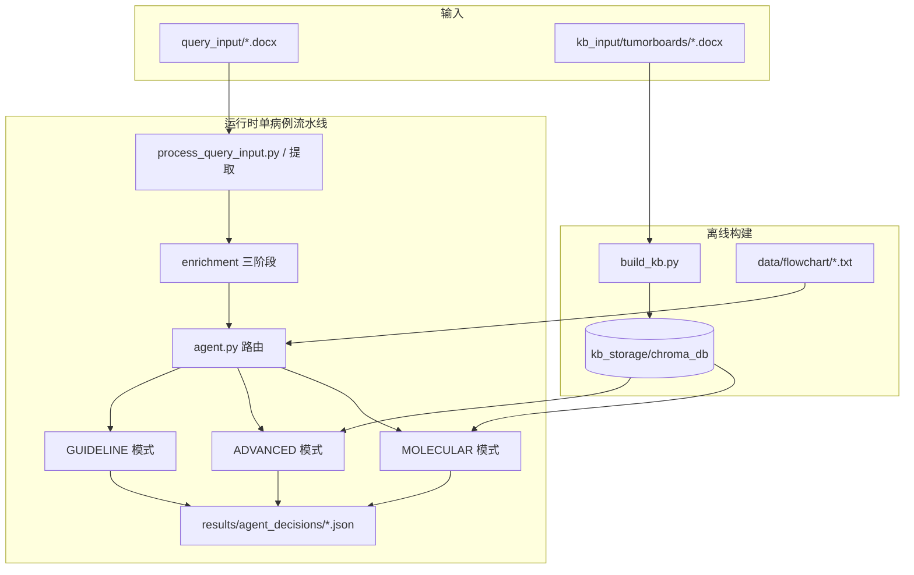
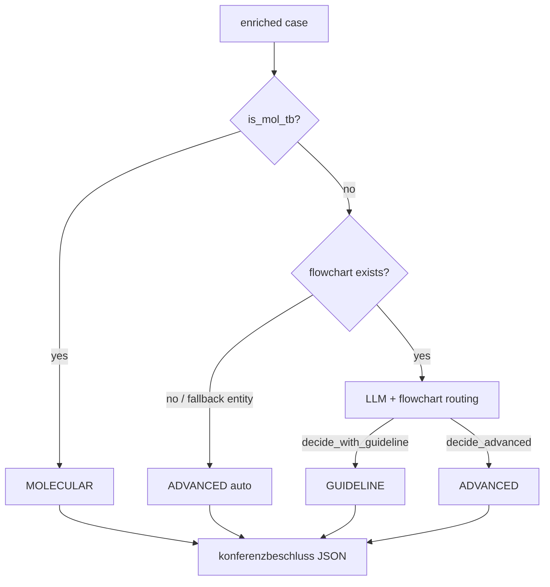

# HemaGuide 系统逻辑说明

本文档梳理 HemaGuide 的整体架构、数据流、决策模式与知识库定位，便于部署、维护与扩展 flowchart / 病例库。

> 研究用途（Research Use Only）。生成结论需经 qualified 血液肿瘤专家审核，不可直接用于临床决策。

---

## 1. 系统目标

HemaGuide 将 **非结构化肿瘤 board 文档**（`.docx`）转为 **结构化 JSON 病例**，再经 **自主路由** 进入三种决策模式之一，输出带可追溯依据的 **德语 Konferenzbeschluss**（JSON：`konferenzbeschluss` + `begründung`）。

核心思想（论文）：**检索优先（retrieval-first）+ 工作流对齐（workflow-aligned）**——不是让 LLM 凭空生成方案，而是把输出锚定在：

- 指南/SOP **决策树**（flowchart）
- **真实病例记忆**（Clinical Case Memory, CCM）
- **文献与会议摘要**（PubMed、CrossRef）
- **分子变异 SOP**（Horak et al. 2022 / ClinGen-CGC-VICC）

---

## 2. 总体架构



| 组件 | 入口 | 作用 |
|------|------|------|
| 知识库构建 | `build_kb.py` | 从 CCM docx 提取 → 分段 embedding → ChromaDB |
| 查询预处理 | `process_query_input.py` | 从 query docx 提取 → `extracted_data/` |
| 决策 Agent | `agent.py` |  enrichment + 路由 + 执行工具 → 最终决策 |
| Web UI / API | `backend/main.py` | 上传、WebSocket 进度、静态前端 |

---

## 3. 运行时流水线（单病例）

### 3.1 阶段一：信息提取（Extraction）

**模块**：`src/extraction.py`  
**Prompt**：`prompts/extraction_base.yaml` + 实体相关 molecular prompt（`prompts/molecular_*.yaml`）

流程：

1. 读取 `.docx`，按标题/附录拆分临床正文与分子附录  
2. **实体分类**：对照 `data/entities.txt` → 映射 `data/entity_slugs.json` → 得到 `entity_slug`（如 `aml`、`myeloma`）  
3. **基础 8 段临床字段** + 从 history 派生 **prior_treatments**（标准化治疗线）  
4. **分子字段**（若有）：`mol_info`（NGS）、`mol_fish`、`mol_recom`  
5. 缓存至 `extracted_data/query_input/{stem}.json`

主要 JSON 结构（`sections` 内）：

| 字段 | 含义 |
|------|------|
| `main_diagnosis` | 主诊断 |
| `secondary_diagnoses` | 合并症 |
| `predictive_factors` | 预后/分子因子 |
| `history` | 病程与治疗经过 |
| `question` / `question_long` | 会议问题（long 为 enrichment 后） |
| `prior_treatments` | 结构化既往治疗线 |
| `age`, `ECOG` | 人口学与体能 |
| `mol_info`, `mol_fish` | 分子数据（JSON 字符串或列表） |
| `is_mol_tb` | 是否分子 tumor board |

### 3.2 阶段二：上下文增强（Enrichment）

**模块**：`src/enrichment.py`  
**Prompt**：`prompts/enrichment.yaml`

三阶段顺序（有依赖）：

1. `question_long` — 扩展临床问题  
2. `tumorboard_type` — 分类为：Erstdiagnose / Rezidiv / Molekulares Tumorboard 等  
3. `decision_long` — 仅 CCM 构建 KB 时需要（query 病例在 agent 前通常只做 1–2）

输出：`enriched_data/query_input/{stem}.json`（`enriched: true`）

### 3.3 阶段三：Agent 路由与决策

**模块**：`agent.py` + `src/tools.py`  
**Prompt**：`prompts/agent.yaml`（路由）、`prompts/decision.yaml`（生成）

路由优先级（**硬规则优先于 LLM**）：

```
1. is_mol_tb == true     → MOLECULAR（自动，不经过 LLM 二选一）
2. entity_slug == fallback 或 无 flowchart 文件 → ADVANCED（自动）
3. 否则                  → LLM 读入 flowchart + 病例，tool_call 选择：
                              decide_with_guideline  |  decide_advanced
4. MOLECULAR 也可由 LLM 在含变异时选择（非 mol_tb 场景）
```

LLM 必须通过 **function calling** 返回 `decide_with_guideline` 或 `decide_advanced`（及 molecular 工具）；禁止纯文本无 tool。

---

## 4. 三种决策模式

### 4.1 GUIDELINE 模式（`decide_with_guideline`）

**适用**：初诊/标准风险、路径落在 Onkopedia + 机构 SOP 决策树内的病例。

**上下文**：

- 完整 enriched 病例  
- `data/flowchart/{entity_slug}.txt` 全文嵌入 prompt  
- **不**做 ChromaDB / PubMed 检索  

**输出要求**：`flowchart_path` 记录所走分支（如 `INT-1a`、`AML-GATE-1`），`begründung` 需引用节点。

**论文结论**：仅 flowchart 即可在 guideline-amenable 初诊病例上达到高 concordance（ablation L1 ≈ 100%）。

### 4.2 ADVANCED 模式（`decide_advanced`）

**适用**：超出指南——复发/ refractory、罕见突变组合、多线失败、flowchart 未覆盖、实体无法识别等。

**检索与合成**（`src/tools.py`）：

1. **Section-Aware RAG**：ChromaDB 按 section embedding 检索相似 CCM 病例（默认 cosine，threshold ~0.7，过检索 ×3 再 LLM rerank）  
2. **治疗线 rerank**：`_rerank_by_treatment`（`prompts/agent.yaml` → `treatment_reranking_prompt`）  
3. **PubMed** + **CrossRef**（ASH/ASCO/EHA 等会议）  
4. **批量 tailoring**：`_tailor_context_batch` → `case_synthesis` / `pubmed_synthesis` / `crossref_synthesis`  
5. 最终 **一次** LLM 决策调用（`generate_context_decision`）

**论文结论**：advanced 病例需 **CCM + 文献 + enrichment** 组合（ablation L8 ≈ 80%），单靠 flowchart 不足（≈ 20%）。

### 4.3 MOLECULAR 模式（`decide_molecular`）

**适用**：分子 tumor board；`is_mol_tb` 或含需解读的 somatic variants。

**流程**：

1. **Horak SOP 自动打分**（12 criteria，多 API：gnomAD、CIViC、OncoKB、VEP 等）→ Oncogenic / VUS / Benign 等  
2. 按基因检索 CCM + PubMed + CrossRef，分子 tailoring prompt  
3. 实体专用 molecular decision prompt（`prompts/molecular_aml.yaml` 等）  
4. 输出靶向治疗或 VUS/试验建议  

与 GUIDELINE/ADVANCED **并行维度**：多数血液肿瘤治疗仍按临床而非分子选线；有 NGS 时才走 MOLECULAR。

---

## 5. 两大知识库

### 5.1 Flowchart 库（指南/SOP 决策树）

| 项目 | 说明 |
|------|------|
| **路径** | `data/flowchart/{entity_slug}.txt` |
| **元数据** | `data/onkopedia.json`（slug、Onkopedia URL、`local_stand`） |
| **实体映射** | `data/entity_slugs.json`、`data/entities.txt` |
| **加载** | `src/tools.load_flowchart(entity_slug)` |

**定位（论文 Methods）**：

- **不是** Onkopedia 全文的「简化摘要」  
- **是** 欧洲指南（主要为 [Onkopedia](https://www.onkopedia.com)）+ **机构 SOP** 编码成的 **可执行决策树**  
- 纯文本、显式节点 ID 与分支（`IF / ELSE / ->`），可直接塞进 LLM context，**无需再解析**  
- 层次：**病种 → 风险分层 → 治疗线**

**与 Onkopedia 网页关系**：

- 网页 §6 含长篇证据与剂量；**Figure 1–4** 为治疗算法图（图片）  
- Flowchart 文本 ≈ Figure 1–4 逻辑 + 机构节点名（如 `INT-1a`、`AML-GATE-1`）；后者在公开 Onkopedia HTML 中通常 **不出现**  
- APL 等亚型可能合并在同一 `aml.txt` 内（`entity_slugs` 中 APL → `aml`）

**版本**：`GET /api/flowchart-status` 对比 Onkopedia 页面 `Stand` 与 `local_stand`。

**仓库策略**：README 声明 flowchart **不随 repo 公开分发**；需自行维护或从机构 SOP 整理。

**示例 AML 节点**（草稿见 `data/flowchart/aml.txt`）：

- `AML-GATE-1` — 初诊紧急度（APL→ATRA；高白细胞→HU prephase）  
- `INT-1a` — CBF / NPM1+FLT3wt / CEBPA bZIP → 7+3 + GO  
- `INT-1c` — AML-MR / tAML → CPX-351  
- `APL-2` / `APL-3` — 高危 APL 与 passage 白细胞管理  
- `REL-*` — 复发路径  

### 5.2 Clinical Case Memory（CCM）

| 项目 | 说明 |
|------|------|
| **输入** | `kb_input/tumorboards/*.docx`（>2000 真实 TB 决策，论文） |
| **构建** | `python build_kb.py` |
| **存储** | `kb_storage/chroma_db/`（ChromaDB） |
| **索引** | Section-level：history、diagnosis、question、therapy summary 等独立 embedding |
| **Embedding** | 默认本地 Ollama `embeddinggemma:300m`（768 维）；可选 OpenAI `text-embedding-3-large` |
| **去重** | 患者级 dedup，避免同一患者相邻时间点泄漏 |

仅 **ADVANCED** 与 **MOLECULAR**（病例证据部分）使用 CCM；GUIDELINE 不用向量检索。

---

## 6. Prompt 文件一览

| 文件 | 用途 |
|------|------|
| `prompts/extraction_base.yaml` | docx → 临床 JSON |
| `prompts/enrichment.yaml` | question_long / tumorboard_type / decision_long |
| `prompts/agent.yaml` | 路由 system prompt、case 模板、context tailoring、treatment rerank |
| `prompts/decision.yaml` | GUIDELINE/ADVANCED/MOLECULAR 决策 system + task + JSON schema |
| `prompts/decision_plain_baseline.yaml` | 无检索 baseline |
| `prompts/prior_treatments.yaml` | 治疗线标准化 |
| `prompts/molecular_*.yaml` | 各实体分子提取/决策 |

决策输出 schema（strict JSON）：

```json
{
  "konferenzbeschluss": "…",
  "begründung": "…"
}
```

---

## 7. 目录与数据流

```
HemaGuide/
├── kb_input/tumorboards/          # CCM 源 docx（离线）
├── query_input/                   # 待决策 query docx
├── extracted_data/
│   ├── kb_input/tumorboards/      # CCM 提取缓存
│   └── query_input/               # query 提取缓存
├── enriched_data/
│   └── query_input/               # enrichment 结果
├── kb_storage/chroma_db/          # ChromaDB
├── data/
│   ├── flowchart/{slug}.txt       # 决策树（非公开，需自备）
│   ├── onkopedia.json             # flowchart 元数据与版本
│   ├── entity_slugs.json
│   ├── entities.txt
│   └── gene_classification.json
├── prompts/                       # 全部 LLM prompt
├── results/
│   ├── agent_decisions/           # 最终 JSON 决策
│   └── agent_prompts/             # 调试：保存完整 prompt
├── agent.py                       # 主 Agent
├── build_kb.py                    # 建 CCM 向量库
├── process_query_input.py         # 批量提取 query
├── plain_llm.py                   # 无工具 baseline
├── backend/main.py                # FastAPI + 静态前端
└── frontend/dist/                 # 预构建 UI
```

**推荐离线顺序**：

```bash
# 1. 建 CCM（耗时长，需 Ollama embedding）
python build_kb.py --llm-mode openai

# 2. 提取 query 病例
python process_query_input.py --llm-mode openai

# 3. 单病例或批量决策
python agent.py --llm-mode openai
```

---

## 8. LLM 与 Embedding 配置

| 用途 | 典型模型 | 说明 |
|------|----------|------|
| 提取 / enrichment | `qwen-flash` 或 `gpt-oss:120b` | `--llm-mode openai` / `ollama-local` |
| 路由 + 决策 | `qwen-plus` 或 `gpt-oss:120b` | agent + tools |
| Embedding（CCM） | `embeddinggemma:300m`（Ollama） | **默认始终本地**；与决策 LLM 提供商可分离 |

环境变量见 `.env`：`OPENAI_API_KEY`、`OPENAI_BASE_URL`（如 DashScope 兼容端点）、`PUBMED_EMAIL` 等。

---

## 9. Web 服务与部署

- **直连**：`uvicorn` / `scripts/start-backend.sh` → `0.0.0.0:8001`，静态资源 + `/api/*` + `/ws`  
- **网关**：`medical_paper_catalog/deploy/gateway/` nginx `:18780` → `:8001`（路径 `/hema_guide/`）；转发机 `172.19.64.72` 经 `:18780` 访问

主要 API：

| 端点 | 功能 |
|------|------|
| `GET /api/health` | 健康检查 |
| `GET /api/flowchart-status` | 对比 Onkopedia 版本 |
| `POST /api/upload` + WebSocket | 上传 docx、流式任务状态 |

---

## 10. 模式选择逻辑图



---

## 11. 与论文 ablation 的对应关系

| 配置层级 | 组件 | 典型 concordance（论文） |
|----------|------|---------------------------|
| L0 | Plain LLM | 低 |
| L1 | Flowchart only | Guideline 初诊病例 ≈ 100% |
| L8 | CCM + 文献 + enrichment + 全 Agent | Advanced ≈ 80% |
| L10 | 全 pipeline + 自主路由 | 综合 ≈ 87% |

**设计含义**：

- 缺 flowchart → 所有「本可走 GUIDELINE」的病例会 **强制 ADVANCED**，失去指南可审计性  
- 缺 CCM → ADVANCED/MOLECULAR 证据不足  
- 缺 enrichment → 检索 query 质量下降  

---

## 12. 扩展与维护清单

### Flowchart

1. 以 `data/onkopedia.json` 为 slug 清单  
2. 对照 Onkopedia Figure 1–4 + 机构 SOP 编写 `data/flowchart/{slug}.txt`  
3. 用 supplementary benchmark rationale 核对节点（如 AML：`INT-1a`、`AML-GATE-1`）  
4. 更新 `local_stand`；定期 `/api/flowchart-status`  

### CCM

1. 脱敏 docx 放入 `kb_input/tumorboards/`  
2. `build_kb.py --rebuild`  
3. 确认 ChromaDB 记录数与 section 索引正常  

### 新实体

1. `entities.txt` + `entity_slugs.json`  
2. `onkopedia.json` 条目  
3. flowchart 文件 + 可选 `prompts/molecular_{entity}.yaml`  

---

## 13. 参考文献

- Horak et al. 2022 — MOLECULAR 模式变异分类 SOP  
- Onkopedia AML（示例）：[DE](https://www.onkopedia.com/de/onkopedia/guidelines/akute-myeloische-leukaemie-aml) / [EN](https://www.onkopedia-guidelines.info/en/onkopedia/onkopedia/guidelines/acute-myeloid-leukemia-aml)  
- 论文：*Clinical decision support in hematological malignancies using a case-grounded AI agent* (Nature Medicine, DOI: 10.1038/s41591-026-04494-4)

---

*文档版本：与仓库当前代码结构一致（含 `data/flowchart/aml.txt` 草稿）。最后更新：2026-07-06。*
